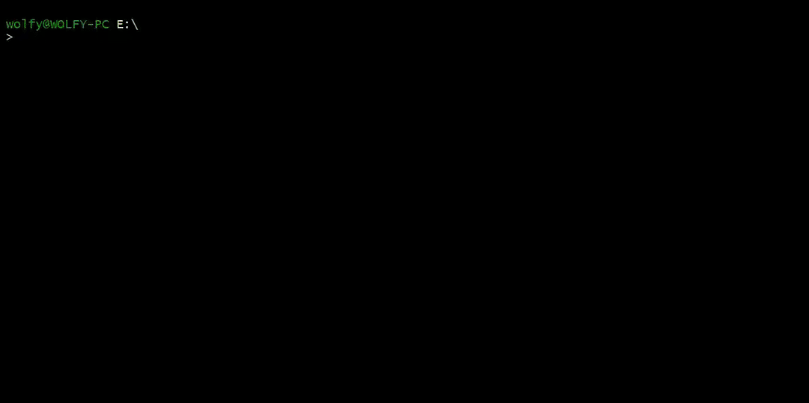

Goffli
==========


[](https://goreportcard.com/report/github.com/wolfy-j/goffli)


Goffli is simple interface and FFmpeg CLI wrapper that offers the ability to convert video, audio, and other multimedia files and streams using small Lua programs which you can share over Github Gist.
> You can save and share this script with others. Every time you reuse it you will save all the time you spent in the past searching Google for ffmpeg bash scripts.



# Installation
Make sure to [install Golang 1.9](https://golang.org/doc/install) on your machine.

```
go get "github.com/wolfy-j/goffli"
```

You can find binaries [here](https://github.com/wolfy-j/goffli/releases).

# Usage
By default, Goffli can only display media information about a given file:

```
goffli info video.mp4
```

If you are looking to extend the possibilities of Goffli's functionality, you can load snippets using a GitHub Gist url:

```
goffli get https://gist.github.com/wolfy-j/d4ece481eb8c9bd8a438967d77603ce7 video2gif
```

These snippets can then be used immediately:

```
goffli video2gif input.mp4 result.gif
```

# Available Snippets

Snippet         | URL
----            | ---
copy            | https://gist.github.com/wolfy-j/8009a8b3be1004d933e105494c64c372
video2gif       | https://gist.github.com/wolfy-j/d4ece481eb8c9bd8a438967d77603ce7

> Feel free to share your own snippets you create above for others in the community.

### Local snippets
You can also test your local Lua script without having to download it from GitHub Gists.

```
goffli run snippet.lua [args]
```

# Coding the Snippet
Writing the code for the snippet is easy. You can utilize a set of functions embedded to a Lua machine in order to make usage more user friendly.

### Input functions
To ask user for the value (automatically populated thought command arguments)

```lua
print(ask("Value"))
```

To validate input value

```lua
local number = ask("Number", "number")
local float = ask("Number", "float")
local file = ask("File", "exists")
local not_empty = ask("Not Empty", "!empty")
```

Default values 

```lua
local quality = ask("Quality", null, "32")
```

### Temp files and directories
To get name of temp directory

```lua
local tmp = require("tmp")
print(tmp.dir())
```

To allocate temporary file with desired extension

```lua
local tmp = require("tmp")
print(tmp.file("mp4"))
```

### FFmpeg functions
Convert with spinner

```lua
require("ffmpeg").run({
  "-i", input,
  "-vcodec", "copy", 
  "-y", output
}, "spinner")
```

Convert with progress bar

```lua
require("ffmpeg").run({
  "-i", input,
  "-vcodec", "copy", 
  "-y", output
}, "progress")
```

Convert without any indication

```lua
require("ffmpeg").run({
  "-i", input,
  "-vcodec", "copy", 
  "-y", output
}, "none")
```

Get media and stream information:

```lua
local info = require("ffmpeg").probe(input)

print(info.format.duration)
```

Display media file information

```lua
require("ffmpeg").probe(input, true)
```

Display media file streams

```lua
require("ffmpeg").probe(input, false, true)
```

> Probe result [example](info.json).

License:
--------
The MIT License (MIT). Please see [`LICENSE`](./LICENSE) for more information.
